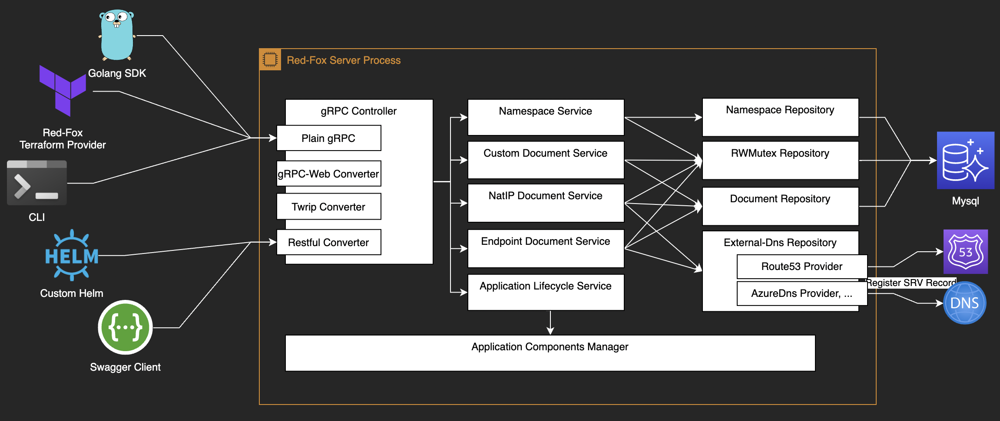

# Proposal

## 이름: RedFox
의미: 개선된 [Fox](https://github.com/pubg/terraform-provider-fox)

## 어떤 데이터를 다룰 것인가?
1. Cloud 리전 데이터: 가까운 AWS 리전, 가까운 ECR+ACR+GCR 리전
2. 클러스터 엔드포인트와 메타데이터
3. NAT IP / Domain 엔드포인트
4. 프로덕트 버전별 메타데이터

## 누구에게 어떻게 제공할 것인가?
기계: gRPC, gRPC-Web, REST API(Optional), Go-SDK

사람: Swagger(Optional), Web UI?, Terraform Provider, Custom Helm, CLI

## 제공할 기능
1. Multi Tenant (Namespace)
2. ApiVersion and Kind
3. CAS(Compare and Swap) and Atomic Operation
4. Identity or Role Based ACL

## API Object 예시
```protobuf
message Namespace { 
  string Name = 1;
  repeated string Labels = 2;
}

message Document {
  string Namespace = 1;
  string ApiVersion = 2;
  string Kind = 3;
  string Name = 4;
  repeated string Labels = 5;
  Spec Spec = 6;
}
```

## 어떤 순서로 개발할 것인가?
1. gRPC, gRPC-Web 우선 개발
2. gRPC 식 url에 Json Body인 Twrip 추가
3. Restful API 추가

## 구조

